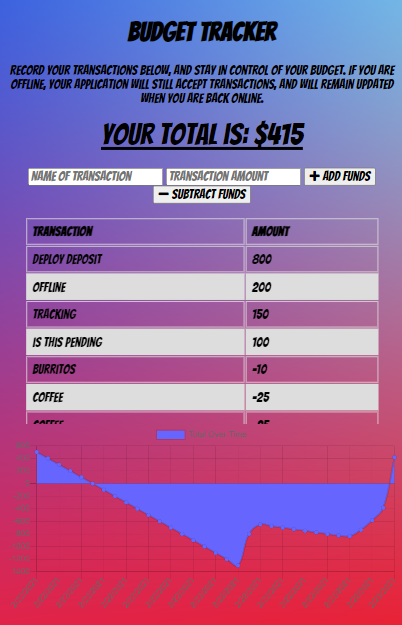

# BudgetTracker

The user will be able to add expenses and deposits to their budget with or without a connection. When entering transactions offline, transactions will populate the total when brought back online.

# Functionality

This application will allow you to record your expenditures without the worry of an internet/data connection.  Simply add the name or type of transaction in the first form field, then add your amount - in dollars - in the transaction amount field.  From there indicate whether it was a positive or negative transaction by clicking the appropriate button and your transaction will be saved.  Your information is displayed in both table and graph form, for quick and easy reference.

# Links and Screenshots

[BudgetTracker Home Page](https://fast-eyrie-35371.herokuapp.com/)

[Github Repo](https://github.com/Tskading/BudgetTracker)

